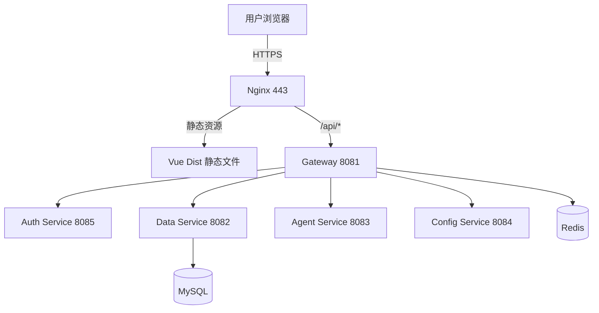

# 架构流程说明

```mermaid
flowchart TD
    A[用户浏览器] -->|HTTPS| B[Nginx 443]
    B -->|静态资源| C[Vue Dist 静态文件]
    B -->|/api/*| D[Gateway 8081]

    D --> E[Auth Service 8085]
    D --> F[Data Service 8082]
    D --> G[Agent Service 8083]
    D --> H[Config Service 8084]

    F --> I[(MySQL)]
    D --> J[(Redis)]
```

## 关键边界

- Nginx 仅负责 SSL 终结和路径分发。
- Gateway 是唯一 API 入口，统一认证、路由、上下文注入。
- 前端以静态文件形式部署，不作为独立微服务进程。
- 业务服务对外暴露只通过 Gateway。
