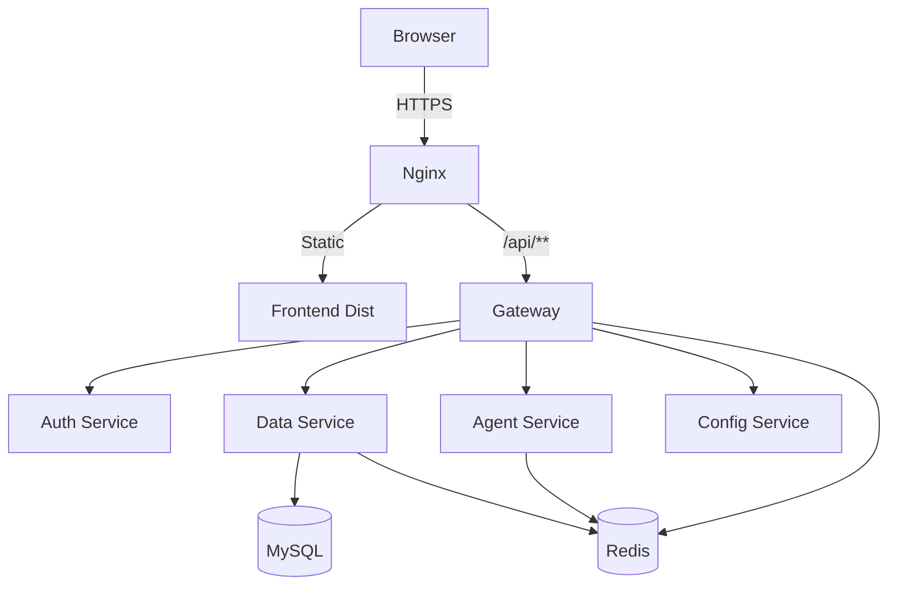

# 系统架构说明

## 1. 总体架构

## 2. 调用链路
1. 客户端请求进入 Nginx。
2. `/api/**` 请求转发到 Gateway。
3. Gateway 完成 JWT 校验、用户上下文与 traceId 注入、限流校验。
4. 请求路由到业务微服务。
5. data-service 与 agent-service 使用 Redis 做缓存与会话/配额控制。
6. agent-service 通过 FastAPI + LangChain 组装提示词，必要时可接入向量检索后再调用 LLM。
7. MySQL 保存业务主数据与任务数据。

## 3. 服务职责矩阵
| 服务 | 端口 | 主要职责 |
|---|---:|---|
| gateway | 8081 | 鉴权、限流、路由、追踪头注入 |
| auth-service | 8085 | 登录注册、用户资料、注销 |
| data-service | 8082 | 数据源、清洗融合、驾驶舱统计 |
| agent-service | 8083 | Python/FastAPI 智能问答、LangChain 编排、会话上下文、下游聚合 |
| config-service | 8084 | 阈值配置 |

## 4. 数据流与状态
- 清洗任务状态：READY -> RUNNING -> COMPLETED/FAILED。
- 融合任务状态：READY -> RUNNING -> COMPLETED/FAILED。
- 异步作业状态：QUEUED -> RUNNING -> COMPLETED/FAILED。

## 5. 架构原则
- 单一入口：禁止绕过 Gateway 直接对外暴露服务。
- 可降级：Redis 或下游异常时优先保证主流程可用。
- 可扩展：异步作业与幂等设计支持并发扩容，agent-service 保留 RAG 与向量库接入位。
- 可观测：统一暴露 Prometheus 指标端点与结构化日志。
