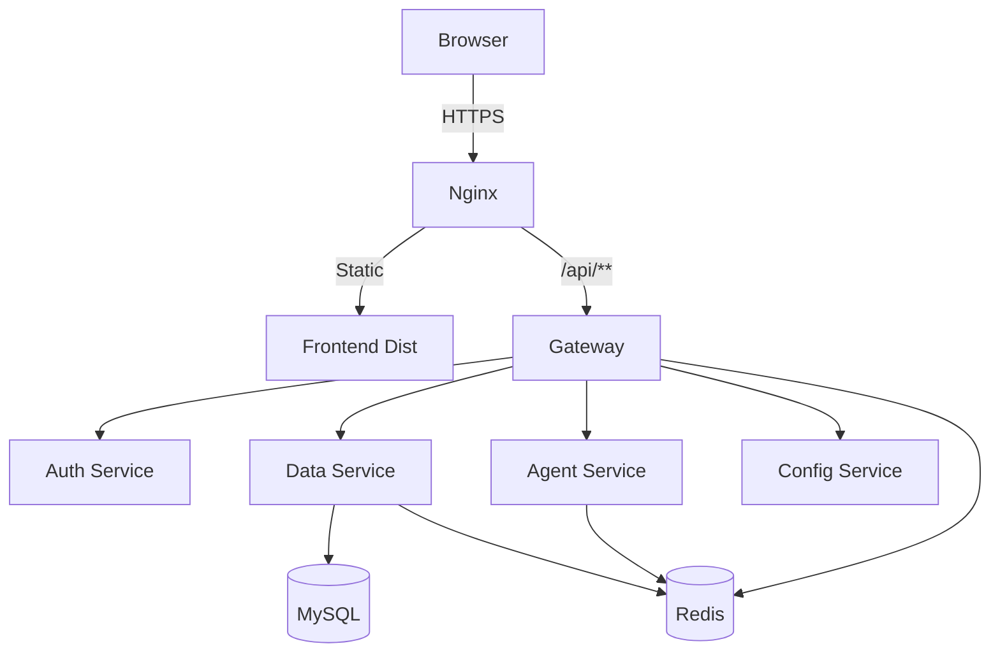
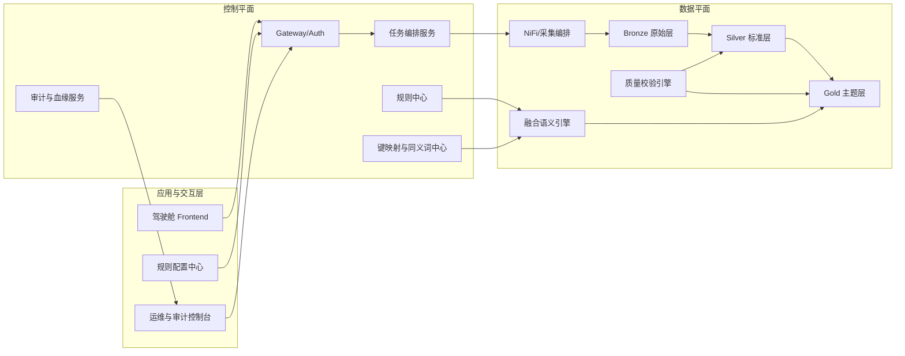

# 系统架构说明

## 1. 当前运行架构（As-Is）

```mermaid
flowchart TD
    A[Browser] -->|HTTPS| B[Nginx]
    B -->|Static| C[Frontend Dist]
    B -->|/api/**| D[Gateway]

    D --> E[Auth Service]
    D --> F[Data Service]
    D --> G[Agent Service]
    D --> H[Config Service]

    F --> I[(MySQL)]
    F --> J[(Redis)]
    G --> J
    D --> J
```

调用链路：
1. 客户端请求进入 Nginx。
2. `/api/**` 请求转发到 Gateway。
3. Gateway 完成 JWT 校验、用户上下文与 traceId 注入、限流校验。
4. 请求路由到业务微服务。
5. data-service 与 agent-service 使用 Redis 做缓存与会话/配额控制。
6. MySQL 保存业务主数据、任务元数据和任务结果。

## 2. 目标架构（To-Be）
目标是“数据平面 + 控制平面”双平面架构，支持多源融合、语义主键匹配、可追溯治理。

```mermaid
flowchart LR
    subgraph UI[应用与交互层]
        U1[驾驶舱 Frontend]
        U2[规则配置中心]
        U3[运维与审计控制台]
    end

    subgraph CP[控制平面]
        C1[Gateway/Auth]
        C2[任务编排服务]
        C3[规则中心]
        C4[键映射与同义词中心]
        C5[审计与血缘服务]
    end

    subgraph DP[数据平面]
        D1[NiFi/采集编排]
        D2[Bronze 原始层]
        D3[Silver 标准层]
        D4[Gold 主题层]
        D5[融合语义引擎]
        D6[质量校验引擎]
    end

    U1 --> C1
    U2 --> C1
    U3 --> C1
    C1 --> C2
    C2 --> D1
    D1 --> D2 --> D3 --> D4
    C3 --> D5
    C4 --> D5
    D5 --> D4
    D6 --> D3
    D6 --> D4
    C5 --> U3
```

设计原则：
1. 接入、清洗、融合、治理解耦，避免业务服务承载全部 ETL 细节。
2. 驾驶舱只消费 Gold 主题层，避免直接绑定原始表结构。
3. 所有融合结果必须可解释：来源记录、匹配规则、置信度、规则版本。

## 3. 融合模型设计

### 3.1 融合策略
1. `KEY_ALIGN`：确定性主键匹配，支持组合键（如 `整改事项ID+整改单位ID`）。
2. `TIME_WINDOW`：时间窗口近邻匹配。
3. `RULE_MATCH`：规则驱动字段匹配。

### 3.2 主键语义层
当前系统已支持同义字段映射（示例）：
1. `整改单位ID` <-> `单位ID`。
2. `整改事项ID` <-> `事项ID`。
3. 支持通过 `app.fusion.key-synonyms-json` 注入自定义同义词扩展。

建议后续将映射字典从代码内置升级为配置中心动态维护，并支持版本化。

### 3.3 粒度约束
1. 明细表与汇总表不建议直接做强主键拼接。
2. 粒度不一致场景应先落到统一语义层（聚合或下钻）再融合。

## 4. 服务职责矩阵
| 服务 | 端口 | 主要职责 |
|---|---:|---|
| gateway | 8081 | 鉴权、限流、路由、追踪头注入 |
| auth-service | 8085 | 登录注册、用户资料、注销 |
| data-service | 8082 | 数据源、清洗融合、驾驶舱统计、融合语义执行 |
| agent-service | 8083 | 智能问答、会话上下文、下游聚合 |
| config-service | 8084 | 阈值配置、规则参数配置 |

## 5. 数据状态机
1. 清洗任务状态：`READY -> RUNNING -> COMPLETED/FAILED`。
2. 融合任务状态：`READY -> RUNNING -> COMPLETED/FAILED`。
3. 异步作业状态：`QUEUED -> RUNNING -> COMPLETED/FAILED`。

## 6. 可观测与治理要求
1. 统一 traceId 链路追踪。
2. 指标覆盖任务成功率、耗时、重试次数、数据质量门禁命中数。
3. 审计记录必须包含输入任务、规则版本、输出表与执行结果。

## 7. 迁移建议（规划阶段）
1. Phase 1：固化融合语义与主键映射模型，稳定 KEY_ALIGN/组合键行为。
2. Phase 2：引入 NiFi 负责接入与调度，保留领域融合逻辑在 data-service。
    - 当前已落地：NiFi 容器、控制平面状态检查、流程触发与触发历史审计。
    - 后续增强：流程模板化、参数上下文版本管理、失败自动重试策略。
3. Phase 3：建设 Bronze/Silver/Gold 分层，驾驶舱改读 Gold。
4. Phase 4：引入元数据血缘平台，实现规则变更与结果可回溯。
