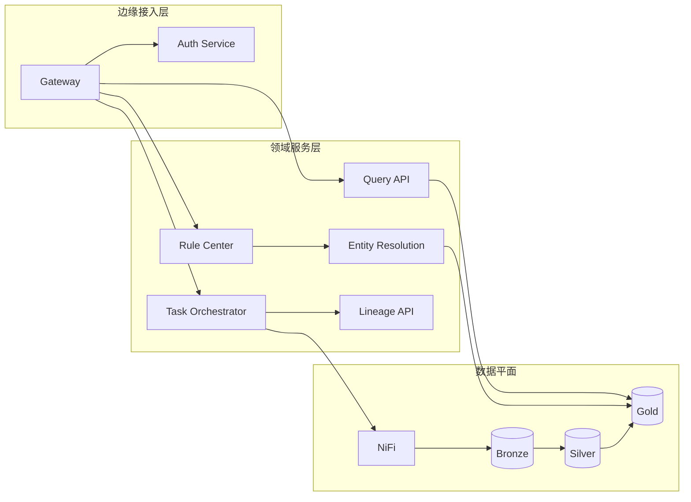

# 架构蓝图与实施方案

## 1. 建设目标
- 支持多源异构数据接入、清洗、融合、治理、可视化闭环。
- 支持确定性/规则/时间窗口融合并可解释。
- 支持规则和主键映射版本化、可回放、可审计。

## 2. 逻辑分层

### 2.1 数据层
- Bronze：原始落地层，不做语义改造。
- Silver：标准化层，字段命名、类型、质量校验统一。
- Gold：业务主题层（审计整改驾驶舱直接消费）。

### 2.2 语义层
- 主键映射中心：统一管理字段同义词和主键模板。
- 融合策略中心：KEY_ALIGN/TIME_WINDOW/RULE_MATCH。
- 融合解释模型：matchType、confidence、sourceRecords、ruleVersion。

### 2.3 服务层
- 编排服务：任务生命周期、重试、幂等。
- 查询服务：预览、统计、下钻、导出。
- 治理服务：血缘、质量、审计事件。

## 2.4 服务边界图


边界原则：
1. `Gateway/Auth` 只负责认证、授权和入口治理。
2. `Task Orchestrator` 不承担具体规则语义，负责状态机与调度。
3. `Entity Resolution` 承担主键语义映射与融合决策。
4. 驾驶舱只访问 `Query API`，不直接读原始中间表。

## 2.5 Bronze/Silver/Gold 表模型草案

### Bronze（原始落地）
| 表名 | 关键字段 | 说明 |
|---|---|---|
| bronze_ingest_record | ingest_id, source_id, object_name, raw_payload, ingest_time | 原始接入快照，禁止覆盖 |
| bronze_file_manifest | ingest_id, file_name, file_hash, row_count | 文件接入元信息 |

### Silver（标准化）
| 表名 | 关键字段 | 说明 |
|---|---|---|
| silver_rectification_detail | record_id, issue_id, dept_id, problem_category, due_date, status | 事项明细标准层 |
| silver_rectification_daily_summary | stat_date, dept_id, problem_category, new_cnt, done_cnt, in_progress_cnt | 日汇总标准层 |
| silver_quality_issue | check_id, rule_code, severity, record_ref, created_at | 数据质量问题明细 |

### Gold（主题层）
| 表名 | 关键字段 | 说明 |
|---|---|---|
| gold_rectification_wide | entity_key, issue_id, dept_id, latest_status, merged_payload, match_type, confidence | 驾驶舱主查询宽表 |
| gold_rectification_kpi_day | stat_date, dept_id, category, overdue_cnt, done_rate, in_progress_cnt | 指标聚合主题 |
| gold_lineage_event | lineage_id, entity_key, source_records, rule_version, run_id | 结果可追溯链路 |

## 3. 主键策略规范

### 3.1 主键表达式
- 单键：`整改事项ID`
- 组合键：`整改事项ID+整改单位ID`
- 规则：组合键中的每个字段必须可在全部参与表中解析到值。

### 3.2 字段映射规范
- 同义字段映射示例：`整改单位ID` <-> `单位ID`
- 映射原则：
  1. 映射必须由业务管理员维护并审核。
  2. 映射变更必须带版本号，影响范围可追踪。

### 3.3 键映射 DSL 样例
```yaml
version: 2026-03-24
keyMappings:
  - canonical: dept_id
    aliases: [整改单位ID, 单位ID, org_id, organization_id]
  - canonical: issue_id
    aliases: [整改事项ID, 事项ID, rect_id, issue_id]
```

### 3.4 融合规则 DSL 样例
```yaml
version: 2026-03-24
rules:
  - code: L1_KEY_ALIGN
    mode: deterministic
    keyExpr: issue_id + dept_id
    onConflict: latest_updated_at
  - code: L2_RULE_MATCH
    mode: rule
    condition: dept_id == dept_id && category == category && abs(days(stat_date, created_at)) <= 1
    score: 0.75
  - code: L3_SIMILARITY
    mode: probabilistic
    threshold: 0.88
    features: [title_sim, amount_delta, time_distance]
```

## 4. 非功能需求
- 可用性：核心链路 >= 99.9%。
- 性能：驾驶舱查询 P95 < 500ms（缓存命中）。
- 安全：统一网关接入，最小权限，多租户隔离。
- 追溯：所有融合结果可反查来源记录与规则版本。

## 5. 90 天实施计划

### 阶段一（第 1-3 周）
- 梳理数据资产、定义主题模型、冻结字段字典。
- 固化主键表达式和映射治理流程。

### 阶段二（第 4-7 周）
- 建设接入编排与分层落地链路。
- 将清洗与融合任务统一到编排状态机。

### 阶段三（第 8-11 周）
- 建设融合解释能力与质量门禁。
- 驾驶舱切换到 Gold 主题层。

### 阶段四（第 12-13 周）
- 上线血缘与审计视图。
- 压测与演练，形成运维手册与回滚预案。

## 6. 里程碑与验收标准

### 里程碑 KPI
1. M1（第 3 周）：主键字典覆盖率 >= 90%，映射审核流程可用。
2. M2（第 7 周）：接入任务成功率 >= 99%，Silver 层质量校验可观测。
3. M3（第 11 周）：Gold 宽表稳定供数，驾驶舱核心接口 P95 < 500ms。
4. M4（第 13 周）：血缘追踪覆盖率 >= 95%，关键流程支持回放。

### 验收标准
- 同一数据集重跑可复现（结果一致或可解释差异）。
- 融合结果支持行级解释与来源追踪。
- 驾驶舱核心指标与主题层口径一致。
- 关键任务失败具备自动告警与可定位日志。